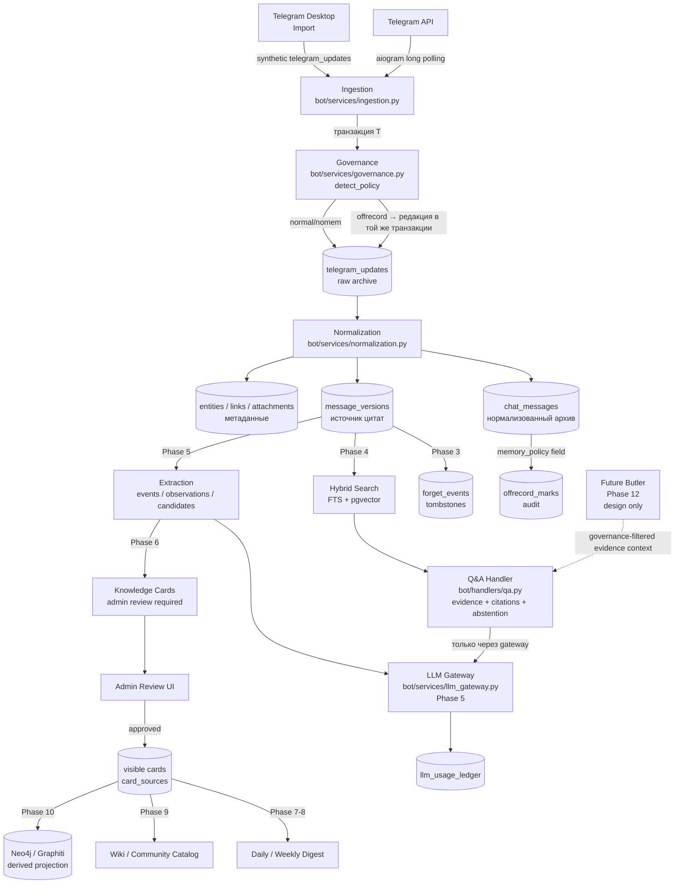

# Архитектура системы памяти Shkoderbot

> Обзор компонентов и потоков данных. Детали — в HANDOFF.md; "почему" — в decisions/.

*Документ актуален на 2026-04-27. Phases 0–1 реализованы/в работе; Phases 2–12 — будущее.*

---

## Диаграмма основного потока данных

---

## Компоненты

### Telegram API / aiogram

Бот получает апдейты через long polling. Текущий набор `allowed_updates`:
`message`, `callback_query`, `chat_member`, `my_chat_member`.

Новые типы (`edited_message`, `message_reaction`) добавляются **только** после появления
соответствующей таблицы и хэндлера — добавить тип без хэндлера означает тихую потерю данных.

Подробнее: HANDOFF.md §8.

---

### Ingestion (`bot/services/ingestion.py`)

Первая точка входа для каждого Telegram-апдейта и для synthetic-апдейтов при импорте.

- Сохраняет raw `telegram_updates` (идемпотентно по `update_id`).
- Открывает транзакцию, в которой происходит и сохранение, и governance-проверка.
- Тегирует строки `ingestion_run_id` (live или import-ран).

Ключевое ограничение: не вызывает LLM, не делает extraction, не обращается к FTS.

Решение: [ADR-0003](decisions/0003-offrecord-irreversibility.md) — атомарная редакция.

---

### Governance (`bot/services/governance.py`)

Детектор политики privacy.

**Phase 1 (текущий цикл):** stub + реальный `detect_policy(text, caption)`.
Возвращает `('normal'|'nomem'|'offrecord', mark_payload_or_None)`.

**Phase 3:** `/forget`, `/forget_me`, tombstone cascade, admin_actions.

Политика применяется **до commit'а**: если `#offrecord` — `raw_json` text/caption/entities
редактируются в той же транзакции. Правило fail-closed: при неизвестной политике — exclude
from memory.

Решение: [ADR-0003](decisions/0003-offrecord-irreversibility.md).

---

### Normalization (`bot/services/normalization.py`)

Преобразует raw Telegram-апдейт в нормализованные строки:
`chat_messages`, `message_versions`, `entities`, `links`, `attachments`.

- `content_hash` (`chv1`) вычисляется по нормализованному тексту, caption, `message_kind`, entities.
- При редактировании: если `content_hash` изменился → новая версия (`version_seq++`), старая сохраняется.
- Идемпотентность: повторный вызов с тем же (chat_id, message_id) не создаёт дублей.

Решение: [ADR-0002](decisions/0002-message-version-as-citation-anchor.md).

---

### message_versions (таблица — источник истины для цитат)

Центральная append-only таблица: каждое изменение content_hash сообщения порождает новую версию.

- Все downstream-цитаты (Q&A, cards, digest, wiki) указывают на `message_version_id`.
- v1 создаётся при первом сохранении; существующие сообщения бэкфиллятся до v1 (T1-07).
- `message_version_id` — единственный стабильный якорь, переживающий редактирования.

Решение: [ADR-0002](decisions/0002-message-version-as-citation-anchor.md).

---

### Hybrid Search + Q&A (Phase 4)

Full-text search по `message_versions` (pgvector + FTS) формирует evidence bundle —
набор релевантных версий с `message_version_id`.

Q&A-хэндлер отвечает только из evidence bundle:
- Если evidence есть → ответ с цитатами.
- Если evidence нет → explicit refusal ("не знаю, нет источников").
- `#offrecord`/`#nomem`/forgotten исключены из поиска на уровне фильтров.

Все LLM-вызовы только через LLM Gateway.

---

### LLM Gateway (`bot/services/llm_gateway.py`, Phase 5)

Единственная точка входа для любых LLM-вызовов.

- Проверяет governance-фильтры перед отправкой контента в модель.
- Логирует вызов в `llm_usage_ledger` (модель, токены, стоимость, caller).
- Применяет budget guard.
- До Phase 5: LLM-вызовов нет совсем.

Решение: [ADR-0004](decisions/0004-llm-gateway-as-single-boundary.md).

---

### Extraction / Candidates (Phase 5)

После Q&A и LLM Gateway: extraction runs анализируют high-signal windows
из evidence bundle → порождают `memory_events`, `observations`, `memory_candidates`.

- Только с явным `source_message_version_id` в каждом кандидате.
- Запрещено отправлять в LLM `#offrecord`/`#nomem`/forgotten контент.
- Derived-строки перестраиваемые — могут быть удалены без потери первичных данных.

---

### Knowledge Cards + Admin Review (Phase 6)

Кандидаты проходят admin review:
- Карточка становится active только после явного одобрения admin'а.
- `card_sources` → `message_version_id` обязательны.
- Карточка без источника не может быть активирована.

Решение: [ADR-0006](decisions/0006-summary-as-derived-never-canonical.md).

---

### Neo4j / Graphiti Graph Projection (Phase 10)

Derived projection из Postgres: карточки, события, связи.

- Только читается downstream (traversal-запросы).
- Пересобирается из Postgres при расхождении или ошибке (`graph_sync_runs`).
- Tombstone в Postgres каскадно purge-ит граф.

Решение: [ADR-0005](decisions/0005-graph-as-projection-not-truth.md).

---

### Telegram Desktop Import (Phase 2a dry-run / Phase 2b apply)

- **Dry-run (Phase 2a):** парсит JSON-экспорт, выдаёт статистику. Контент не пишет.
- **Apply (Phase 2b):** генерирует synthetic `telegram_updates`, которые проходят через
  тот же `ingestion → governance → normalization` путь, что и live-апдейты.

Tombstone-check выполняется перед записью каждого сообщения.

Решение: [ADR-0007](decisions/0007-import-through-same-governance.md).

---

### Future Butler (Phase 12 — design only)

Не реализуется. Extension points сохраняются: permissions, audit, action boundary,
будущие `action_requests` / `action_runs`.

Ключевое ограничение: butler **не читает** raw DB напрямую. Любое взаимодействие —
только через governance-filtered evidence context.

---

## Boundaries (что куда НЕ ходит)

| Источник / Actor | Нельзя делать | Почему |
|---|---|---|
| Любой сервис | Вызывать LLM напрямую (не через gateway) | ADR-0004: единая точка governance + audit |
| Q&A / Extraction | Использовать `#offrecord`/`#nomem`/forgotten в промптах | ADR-0003: privacy |
| Graph / Butler | Читать raw `telegram_updates` или `message_versions` напрямую | ADR-0005, invariant 7 |
| Derived слои (summaries, digest, graph) | Быть источником истины или источником для цитат | ADR-0006 |
| Import apply | Обходить `ingestion → governance → normalization` путь | ADR-0007 |
| Coding agents | Реализовывать Phase 2b+ до прохождения phase gates | AUTHORIZED_SCOPE.md |
| Любой компонент | Добавлять Telegram update types без handler + storage | HANDOFF.md §8 |
| Tombstones | Откатываться "на всякий случай" | ADR-0003, invariant 9 |
| Public wiki | Публиковаться до governance + review + source trace | invariant 10 |

---

## Статус компонентов по фазам

| Компонент | Фаза | Статус (2026-04-27) |
|---|---|---|
| Ingestion (raw updates) | 1 | В работе |
| Governance (policy detector) | 1/3 | Stub в работе; full — Phase 3 |
| Normalization + message_versions | 1 | В работе |
| Hybrid Search | 4 | Не авторизовано |
| Q&A Handler | 4 | Не авторизовано |
| LLM Gateway | 5 | Не авторизовано |
| Extraction | 5 | Не авторизовано |
| Knowledge Cards | 6 | Не авторизовано |
| Graph Projection | 10 | Не авторизовано |
| Butler | 12 | Design only, не реализуется |

Актуальный статус каждого тикета: [IMPLEMENTATION_STATUS.md](IMPLEMENTATION_STATUS.md).
